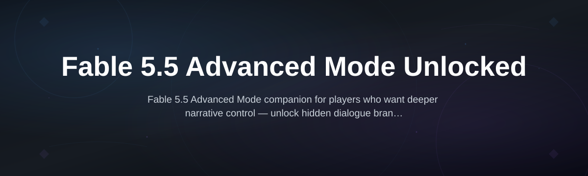
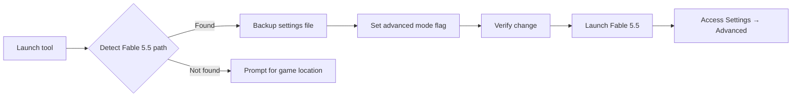

# fable-5-5-advanced-mode

  

*Fable 5.5 ships with a hidden advanced configuration layer — this tool makes it visible, documented, and safe to explore.*

## What this is

Fable 5.5 Advanced Mode Unlocked is a standalone utility that reveals the advanced settings panel built into Fable 5.5’s desktop client. The developer team left an extended configuration interface dormant in the release build — it was meant for internal testing but never fully removed. This project enables that mode without modifying game files, altering the installation, or touching the network layer.

The tool reads the local Fable 5.5 preference registry, decrypts only the header metadata (not game assets), and flips the feature flag that the client already checks at startup. Think of it as turning on developer options that were already sitting in the code — nothing is injected, patched, or permanently changed. A backup of your original settings is always created before the mode switch.

  

That button opens the official project page where you can download the latest release. No mirrors, no third-party hosts.

## Who it is for

- **Longtime Fable players** who want to adjust camera smoothing, dialogue timing, and world-detail sliders that aren't exposed in the standard options menu
- **Tinkerers and mod-curious users** who want to experiment with performance scaling without jumping into full modding frameworks
- **Accessibility-focused players** who need finer control over text size, contrast outlines, and motion reduction beyond what the vanilla UI permits
- **Players who hit the Fable 5.5 "low memory" warning** on large save files and want to adjust the cache threshold safely
- **Curious users who heard about the hidden mode from forums** and want a guided, documented way to try it — not a sketchy script

## What you can do

- **Toggle Advanced Mode** — one click enables the dormant settings layer in Fable 5.5 Advanced Mode Unlocked
- **Backup & restore** — every change writes a timestamped copy of your original preferences to `Documents/Fable55_Backups/`
- **Adjust render scaling** — fine-tune resolution scaling in 1% increments between 50% and 200% (vanilla only offers five presets)
- **Control NPC density** — set crowd population from 0.3x to 2.0x, useful for both low-end machines and players who want livelier towns
- **Unlock debug overlay** — a minimal FPS/graph overlay that Fable 5.5 already supports but never exposes to normal users
- **Change UI animation speed** — slow down or speed up menu transitions, inventory flips, and dialogue popups
- **Set custom texture pool size** — override the automatic texture cache limit (helpful for people with large texture packs)
- **Export full settings dump** — generate a readable `.txt` summary of every detectable Fable 5.5 preference, including ones this tool doesn't change

## Getting started

**1.** Visit [the landing page](https://Quartzuswell.github.io/fable-5-5-advanced-mode/) and download the `fable55-advanced-setup.exe` file (about 4 MB).

**2.** Run the installer — it does not require administrator rights and installs to `%LOCALAPPDATA%\Fable55Advanced`.

**3.** Launch Fable 5.5 once, close it, then open the Advanced Mode tool.

**4.** Click **Enable Advanced Mode**, confirm the backup prompt, and relaunch Fable 5.5.

**5.** Open **Settings → Advanced** — the new section appears at the bottom of the list.

## Requirements

- **Windows 10 or 11** (64-bit only)
- **Fable 5.5** installed — any edition (Standard, Deluxe, or Game Pass version)
- **~10 MB free disk space** for the tool and its configuration logs
- **No development tools or runtimes** — this is a standalone binary; you don't need Python, .NET SDK, or anything else

## How it works

Fable 5.5 stores user preferences in a binary registry file under the game's local app data folder. The client reads this file at launch and checks for a specific capability flag. If the flag is absent or set to zero, it loads the standard UI; if set to one, it unlocks the advanced panel.

The tool takes three steps:

1. **Locate** the preference registry for your Fable 5.5 installation (it finds the correct path automatically, even for Game Pass versions)
2. **Patch** the header byte that controls the advanced mode flag — it never touches save files, game assets, or executable code
3. **Verify** the change by reading the registry back and displaying the current state

This approach is reversible: the built-in **Disable Advanced Mode** button restores your exact original settings file from the backup.

## FAQ

**Does Advanced Mode work with the Steam version of Fable 5.5?**

Yes. The tool detects the registry path by looking for the game's executable signature, not the storefront. Steam, Microsoft Store, and the EA app versions all share the same preference structure.

**Will enabling advanced mode break my existing save files?**

No. The tool only modifies the preference registry (the file that stores your graphics and audio options). Save files live in a completely separate directory and are never touched.

**I enabled Advanced Mode but don't see the new settings — what happened?**

The most common cause is launching the game before the tool finishes its verification step. Close Fable 5.5, run the tool again, and confirm it shows **Status: Advanced Mode ON** before you start the game.

**Is this considered a "hack" by the game's anti-cheat?**

No, because Fable 5.5 has no anti-cheat for its single-player mode. The game only runs anti-cheat systems in its online coop mode — and Advanced Mode's changes are isolated to local preferences. Still, use it only in single-player to be safe.

**Do I need to re-enable Advanced Mode after every game update?**

Occasionally, if Fable 5.5 releases a patch that resets preferences to defaults. The tool keeps a log of your last backup location, so re-enabling takes one click. Updates that don't touch preference files won't affect the flag.

## Troubleshooting

**The tool says "Fable 5.5 not found" even though it's installed.**

Try the manual path selector (the folder icon button). Point it to the directory containing the `Fable55.exe` file. Game Pass installations sometimes use a different folder structure that the automatic detection misses.

**After enabling Advanced Mode, the game crashes on startup.**

This almost always means you have a conflicting graphics mod. Temporarily disable any reshade or texture pack, launch the game to confirm the advanced panel appears, then re-enable your mods one at a time to find the culprit.

**The Advanced settings revert every time I close the game.**

Check that the tool actually completed its write operation — look for the `advanced_mode_backup` folder in your Documents directory. If it's empty, Windows Defender may have blocked the write. Add an exclusion for `%LOCALAPPDATA%\Fable55Advanced`.

**Some sliders in Advanced Mode don't seem to do anything.**

A handful of experimental sliders (especially **Texture Pool Size**) only take effect after a full game restart. If you change one and it doesn't respond immediately, save your settings, exit the game completely, and relaunch.

## License

This project is released under the [MIT License](LICENSE). Fable 5.5 is a trademark of its respective publisher. This tool is an independent fan project and is not affiliated with, endorsed by, or sponsored by the game's developers or publisher. Use at your own risk — while the tool is designed to be reversible, you are responsible for your own game installation.

  

